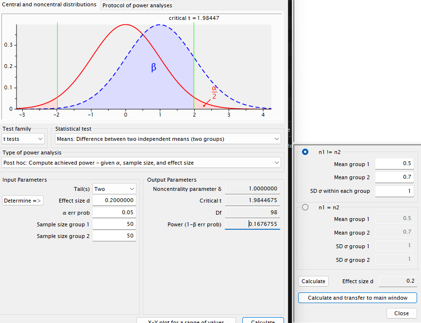

```{r setup, include=FALSE}
knitr::opts_chunk$set(echo = TRUE)
```

# First simple simulation

## Create a design matrix

For each simulation, the first step we want to take care of is to create a design matrix. 
In simple terms, this is a data frame that contains the information about parameter values as well as group identities and other info of participants. 
In this case, the design matrix needs to contain the following information:

- `group`: The group identity of the participant (i.e., negative vs. positive clip)
- `intercept (b0)`: the value we assign to the mean of the negative group
- `slope (b1)`: the value we assign to the difference between the negative and positive group
- `error`: the error term that we add to the data

```{r}
set.seed(234)


n_participants <- 100

b0 <- 0.5
b1 <- 0.2
error <- rnorm(n_participants, 0, 1)

group <- rep(c(0, 1), each = n_participants / 2)

design_matrix <- data.frame(b0, b1, group, error)

View(design_matrix)
```


## Create a dependent variable

Next, we want to create a dependent variable that is based on the design matrix.
In this case, we want to create a dependent variable that is based on the following formula:

$$
y = b0 + b1 * group + error
$$

```{r}
design_matrix$Y <- design_matrix$b0 + design_matrix$b1 * design_matrix$group + design_matrix$error
View(design_matrix)
```

In principle, we could no just run a t-test on the dependent variable to see if the groups differ.

```{r}
t.test(design_matrix$Y ~ design_matrix$group, var.equal = TRUE)
```

To illustrate the point, we can see that this is exactly the same as running a linear model.

```{r}
summary(lm(Y ~ group, data = design_matrix))
```

As we can see, the p-values of the t-test and the linear model are identical.

## Simulate this question as a pre-post design

Now, let's simulate a pre-post design for the same question. 
This time, our dependent variable will be the post scores, where the pre scores are added to the model as a predictor.

This time the model formula is:

$$
y = premeasure + groupeffect + error
$$

In this case, as we want to simulate a pre-post design, in which the group effect depends on the group, we will precalculate the b1*group value and add it to the dependent variable.

Note that this is technically identical to just using b1 = 0.2 but one nice thing of simulations is that we don't need to think about these technicalities, and can instead directly put in the numbers that we thought of.


```{r}
set.seed(345)

n_participants <- 100
pre_measure <- floor(rnorm(n_participants, 5, 2))
pre_measure
pre_measure <- ifelse(pre_measure < 1, 1, pre_measure)
pre_measure <- ifelse(pre_measure > 7, 7, pre_measure)
hist(pre_measure)

error <- rnorm(n_participants, 0, 1)

group <- rep(c(0, 1), each = n_participants / 2)

design_matrix <- data.frame(pre_measure, group, error)
design_matrix$group_effect <- ifelse(design_matrix$group == 1, 0.7, 0.5)

design_matrix$Y <- design_matrix$pre_measure + design_matrix$group_effect + design_matrix$error
```

Now, we can run a linear model to see if the groups differ.

```{r}
summary(lm(Y ~ pre_measure + group , data = design_matrix))
```

Or we could run this as an ancova.

```{r}
library(car)
ancova_model <- aov(Y ~ pre_measure + group, data = design_matrix)
Anova(ancova_model, type="III")

```

As we can see, the test statistics are again identical. 

Specifically, the squared t-values of the lm are identical to the F-values of the ancova.

If we take a close look at parameter values, however, we might wonder why the parameter for the group effect is not 0.7 as we wanted but 0.94.
This is due to the fact that there is noise in the simulation and with only 100 people, the simulated scores might not be close to the parameter value that we intended to simulate.
If we increase the number of participants, we can see that the parameter estimates get closer to the true value.

```{r}
set.seed(345)

n_participants <- 100000
pre_measure <- floor(rnorm(n_participants, 5, 2))

pre_measure <- ifelse(pre_measure < 1, 1, pre_measure)
pre_measure <- ifelse(pre_measure > 7, 7, pre_measure)
hist(pre_measure)

# b1 <- 0.2
error <- rnorm(n_participants, 0, 1)

group <- rep(c(0, 1), each = n_participants / 2)

design_matrix <- data.frame(pre_measure, group, error)
design_matrix$group_effect <- ifelse(design_matrix$group == 1, 0.7, 0.5)

design_matrix$Y <- design_matrix$pre_measure + design_matrix$group_effect  + design_matrix$error
```

```{r}
summary(lm(Y ~ pre_measure + group, data = design_matrix))
```

In this case, the parameter estimates are much closer to the intended value of 0.7.

## Short example of power simulation

So if we want to know what our power with e.g. 100 participants would be, we can repeat the simulation many times, save the p-values for each simulation, and then calculate the proportion of times that the p-value is below 0.05.

```{r}
set.seed(123)
n_participants <- 100
b0 <- 0.5
b1 <- 0.2

p_values <- c()

for(i in 1:1000){

  n_participants <- 100

  error <- rnorm(n_participants, 0, 1)

  group <- rep(c(0, 1), each = n_participants / 2)

  design_matrix <- data.frame(b0, b1, group, error)

  design_matrix$Y <- design_matrix$b0 + design_matrix$b1 * design_matrix$group + design_matrix$error

  simulated_p_value <- t.test(design_matrix$Y ~ design_matrix$group, var.equal = TRUE)$p.value

  p_values <- c(p_values, simulated_p_value)

}

power <- sum(p_values < 0.05) / length(p_values)
print(power)
```

In this case, the power of the test would be 0.173.

So let's compare this to G*Power.

  

As we can see, the power is very similar to the power we calculated in R.

# Simulating mixed models

To make this easier for us, we will write a function that generates the design matrix for us.
This is basically doing what we did before, but in a function that we can call with different parameters like the number of participants, the number of genres, and the number of songs.

```{r}
generate_design <- function(n_participants, n_genres, n_songs){
  
  
  design_matrix <- expand.grid(participant = 1:n_participants, genre = 1:n_genres, song = 1:n_songs) # adding song to expand.grid
  design_matrix$genre <- ifelse(design_matrix$genre ==1, "rock", "pop")
  design_matrix$song <- paste0(design_matrix$genre, "_", design_matrix$song) 
  return(design_matrix)
}
```

```{r}
n_participants <- 10
n_genres <- 2
n_songs <- 20

song_data <- generate_design(n_participants = n_participants, n_genres = n_genres, n_songs = n_songs)
View(song_data)
```

Now in the next step, we need to define the parameters again.
First lets start out with the parameters we had before:

```{r}
b0 <- 75 # this is what we think the overall liking is across genres in the population
b1 <- 5 # this is the difference between rock and pop songs, meaning that people on average like rock songs 5 points more than pop songs

```

As before, b0 and b1 are just single values, as they are _fixed effects_ meaning that they are the same for each participant.

In contrast, the random effect for participants that we want to add is a bit more complicated.
In this case, we want to simulate that each participant has a different intercept.
This intercept reflects that each participant might have a different baseline level of liking for songs, that deviates somewhat from the 75 liking that we have in the population.
In other words, some people might like music a little bit less than others (lets say 60 on average) and others might like music a little bit more (lets say 80 on average).

```{r}
set.seed(123)

sd_u0 <- 7 # this is the standard deviation of the random intercepts
U0 <- rnorm(n_participants, 0, sd_u0) # this is the random intercept for each participant
print(U0)

hist(75+U0, main = "Participant-specific music liking", xlab = "Liking score (0-100)")
```

We can see in the histogram, that we now have different "baseline music liking" for each participant.

Now lets simulate the dependent variable based on this.

```{r}
set.seed(123)

error <- rnorm(nrow(song_data), 0, 10) # this is the error term that we add to the data

song_data1 <- song_data

for(i in 1:nrow(song_data1)){
  song_data1$Y[i] <- b0 + b1 * ifelse(song_data1$genre[i] == "rock", 1, 0) + U0[song_data1$participant[i]] + error[i]
}
View(song_data1)
```

In the above, we defined an error term that is again different for each observation.
This is because, each single observation has some unknown factors that influence it. 
Hence, we need to have as many values for this error as we have observations.
For participants, we only have 10 values, as we only have 10 participants.

Now we can fit a mixed model to this data.

```{r}
library(lme4)
song_model_1 <- lmer(Y ~ genre + (1|participant), data = song_data1)
summary(song_model_1)
```

We can see that the model estimates are very close to the values that we simulated.

## Convergence Warning: boundary (singular) fit: see ?isSingular

If you have fitted a mixed model before, you might have seen this warning.
In fact let's see what happens if we assume that participants liking for music is overall very similar to the population average.
In other words, what happens if participants do not differ in their baseline liking for music.

```{r}
set.seed(123)
sd_u0 <- 0.1 # this is the standard deviation of the random intercepts

U0 <- rnorm(n_participants, 0, sd_u0) # this is the random intercept for each participant

```

Now we can simulate the data again.

```{r}
set.seed(123)
error <- rnorm(nrow(song_data), 0, 10) # this is the error term that we add to the data
song_data2 <- song_data
for(i in 1:nrow(song_data2)){
  song_data2$Y[i] <- b0 + b1 * ifelse(song_data2$genre[i] == "rock", 1, 0) + U0[song_data2$participant[i]] + error[i]
}
```

and again fit the model

```{r}
song_model_2 <- lmer(Y ~ genre + (1|participant), data = song_data2)
summary(song_model_2)
```

We can see that the we now get a warning that the model is singular.
This means that the best fitting model is one that is on the boundary of what the model can estimate.
The reason for this is that the deviation for overall liking of music across participants is estimated as a standard deviation. 
By definition, standard deviations need to be greater than 0.
If we set the standard deviation to 0 or very close to 0, this warning will tell us that the best-fitting solution of the model is one that is very close to the boundary of what the model can estimate.

We can see that the other estimates of the model are nearly identical. 
Hence, the other estimates can in this case still be trusted, and the warning only occurs because the model (rightfully) estimates the standard deviation of the random intercept to be very close to 0.

The problem is that usually, with real data, we do not _know_ the true value of the random effects and hence, we cannot know for sure whether the singularity warning is trivial (like in this case) or not.
However, if we see that one random effect is estimated to be very close to 0, we can see what happens if we exclude this effect.

```{r}
song_model_3 <- lm(Y ~ genre, data = song_data2)
summary(song_model_3)
```

We see that the effects without the random intercept are very similar to the effects with the random intercept.

Now we can also see what happens if there _is_ a participant-specific difference in overall liking, but we fail to account for it:

```{r}

song_model_4 <- lm(Y ~ genre, data = song_data1)
summary(song_model_4)
```

We see that in the latter case, when we just run a model without accounting for the random intercept, the p-value for the genre effect is larger, and the error variance is larger.
This is because the model will try to account for the participant-specific differences in overall liking by attributing this to the error term.
This in turn decreases the power of the model to detect the genre effect, and decreases the amount of explained variance.
